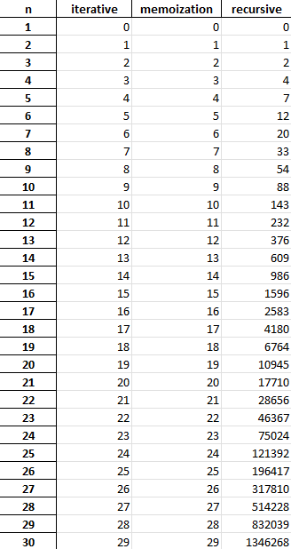
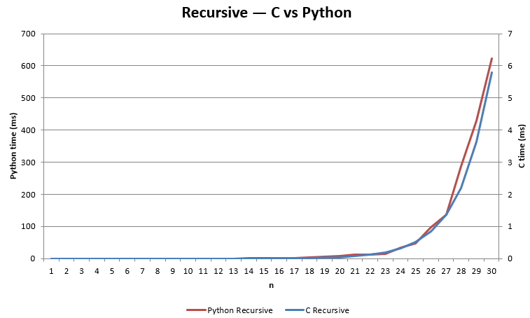
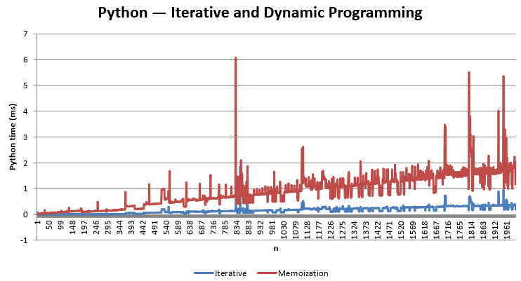
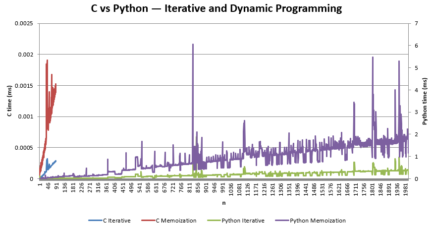
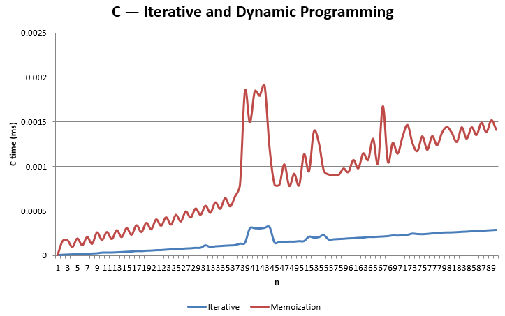

[](https://classroom.github.com/a/kdfTwECC)
# Midterm p1: Report on Analysis of Fibonacci  Series
* **Author**: Najib Mosquera
* **GitHub Repo**: https://github.com/CS5008Fall2025/midterm-report-NHazelJ/tree/main
* **Semester**: Fall 2025
* **Languages Used**: C, python

## Overview
This report compares the speed and efficiency of different programming approaches for the Fibonacci algorithm.[1] The Fibonacci Numbers is one of the most popular sequences in mathematics and computer science. Each number in the sequence is the sum of the two numbers that before it, with F(0) = 0 and F(1) = 1. This can be mathematically described:
$$F{(n)} = F{(n - 1)} + F{(n - 2)} $$
Where F(0) = 0 and F(1) = 1  
A typical Fibonacci sequence up to N=10 looks like the following: 0 1 1 2 3 5 8 13 21 34 55  
The Fibonacci Sequence appears in nature, architecture, and computer science. It is commonly used to demonstrate recursion, dynamic programming, and time complexity analysis in algorithms. For this report, the Fibonacci sequence was implemented in 
C and python using three methods: Iterative, Recursive and dynamic programming like memoization. Each method has unique trade offs in runtime and space complexity.

| Version |  Big O | Space Used | 
| :-- | :-- |  :-- |
| Iterative | $O(n)$ | $O(1)$ |
| Recursive | $O(2^n)$  | $O(n)$ |
| Dynamic Programming | $O(n)$ | $O(n)$ |
  
Below I have broken down the pseudocode for the respective version of the Fibonacci:  
The iterative version of the fibonacci in pseudocode in C and python.

The iterative Fibonacci loop runs once for each value from 2 to n, performing a constant amount of work each time. This gives $O(n)$ time complexity and $O(1)$ space usage, since only a few variables a , b and temp are stored.[1][4][6]
```text 
int fibonacci_iterative(int n) {
    if (n <= 1) 
        return n;
    int a = 0, b = 1, temp;
    for (int i = 2; i <= n; i++) {
        // adding the previous two numbers
        temp = a + b;
        // move b to a
        a = b;
        // new values is the next number
        b = temp;
    }
    return b;
}
```
The Recursive version of the fibonacci in pseudocode in C and pyhon.
The recursive Fibonacci function calls itself twice for each non base case, forming a binary recursion tree with about 2ⁿ nodes. This results in $O(2^n)$ time complexity and $O(n)$ space due to the maximum recursion depth.[4][6]
```text 
int fibonacci_recursive(int n) {
    if (n <= 1)
        return n;
    return fibonacci_recursive(n - 1) + fibonacci_recursive(n - 2);
}
```
The Dynamic version using memoization of the fibonacci in pseudocode in C and pyhon
```text
int memo[1000];

int fibonacci_dp(int n) {
    if (n <= 1)
        return n;

    if (memo[n] != -1)
        // already calculated
        return memo[n];
    memo[n] = fibonacci_dp(n - 1) + fibonacci_dp(n - 2);
    return memo[n];
}
```
In the memoized implementation, each Fibonacci value is computed only once and then reused. This reduces redundant calls, giving $O(n)$ time and $O(n)$ space complexity for storing the memoized results and recursion stack. [3][4][7]

The iterative implementation of Fibonacci uses a for loop. It starts with 0 and 1, adds them together to get the next number, and then does the same thing over and over to make more numbers. The algorithm is well known and works very effectively because the loop only runs once for each phrase and only a few variables are saved. [1]

To figure out each, the recursive form of the Fibonacci algorithm calls itself twice: once for F(n-1) and once for F(n-2). The first two values are 0 and 1, and each time the function calls itself, it adds to those to get the next value. This method is easy to understand, but it's also the slowest because it does a lot of the same math again and over. It takes O(n) space because of the recursion stack and $O(2^n)$ time because of the exponential time complexity.[1]

The dynamic programming version overcomes the problem with recursion by keeping track of results that have previously been found. The program doesn't recalculate the same n value, it just looks it up. This speeds things up a lot, lowering the time complexity to $O(n)$ and the space needed for storage to $O(n)$.[2][3]

## Empirical Data & Discussion   
### Fibonacci empirical results:  

For all empirical Fibonacci results, the maximum runtime was capped at 60 seconds per run. The times are all in milliseconds. This provided a consistent upper limit for both Python and C implementations, ensuring fair comparisons while allowing the completion of multiple test iterations within the code.

### Operations comparison

The number of operations for each Fibonacci algorithm was tracked using a counter within each function. The counter was placed at the same logical point in both the C and Python versions to ensure consistency.
In the DP memoization code, the counter was integrated with the recursive logic, meaning that cached results did not increment the counter, producing an identical count pattern between C and Python and confirming correct counter placement.

### Operations Count


Because recursive Fibonacci functions grow exponentially, operation counts increased dramatically for higher values of N, reflecting the well known inefficiency of recursion.[4] The iterative and memoization versions, on the other hand, showed linear or near linear growth, confirming the expected time complexities. [5] For the entire csv files comparing both language: [python Fib results](fibResultsPython2000.csv) and [C Fib results](fibResultsC.csv)


### Recursive functions
Below, we highlight the speed for the recursive algorithm  


 

Both recursive versions of the Fibonacci algorithm exhibited clear exponential growth in execution time as N increased, though within the experimental range the runtimes remained below one second. The Python recursive implementation reached its upper tested limit at N = 30, taking approximately 624 ms (0.62 s). The C recursive implementation reached the same N = 30 but executed much faster, taking roughly 5.8 ms ( 0.0058 s). The results show that, even for small N, Python’s recursion overhead produces noticeably slower performance than C compiled implementation. As shown above, the chart illustrates these differences using a double axis plot, the left axis represents Python runtimes, which grow faster, while the right axis represents C runtimes, which remain far lower but follow the same exponential trend. Both implementations align with the theoretical O(2^n) time complexity and O(n)space complexity due to recursive call stack depth.[7]

### Iterative and Dynamic Programming functions  
The iterative and dynamic programming memoization implementations of the Fibonacci algorithm demonstrated substantial performance improvements compared to the recursive versions, allowing for evaluation across much larger input values. As shown below, the python implementations both maintained millisecond runtimes, with the iterative version performing slightly faster and more consistently than memoization, which displayed occasional spikes due to cache lookups and recursive overhead.  



When comparing both languages, figure below, highlights that the C versions are significantly faster overall. The C iterative and memoization curves remain below 0.002 ms, whereas the Python equivalents scale between 0.1 and 6 ms across similar N values. Despite the absolute difference in speed, both languages exhibit the same general shape and linear growth pattern, confirming the expected $O(n)$ time complexity. [6][7]



Finally, the following figure shows that within C alone, the iterative version remains the most efficient and stable, while memoization  incurs minor overhead from repeated recursive calls and memory access management. Overall, these results align with dynamic programming theory, which replaces redundant subproblem computations with efficient table lookups. Both implementations clearly demonstrate the superior scalability of iterative and dynamic programming approaches over exponential recursive algorithms.



### Speed Comparison Between Languages

In all cases, the c implementations of the Fibonacci algorithms outperformed their python counterparts, consistent with the expected efficiency of compiled versus interpreted languages. The performance difference was modest for smaller values of N but became increasingly pronounced as N grew larger. This was most evident in the recursive version, where Python runtime expanded significantly faster due to interpreter overhead and slower recursive call handling.

The following table summarizes the average and maximum speed differences observed between the C and Python implementations across the three methods, we are seeing how different of speed they were at specific algorithm:

| Version | Average Speed Difference | Max Speed Difference |
| :-- | :-- | :-- | 
| Iterative | 1.58× |	6.41× | 
| Dynamic Programming | 3.27× |	12.94× | 
| Recursive | 107.5× |	107.5× |

Across all methods, the algorithms followed the expected big O patterns. Both the iterative and DP memoization versions exhibited O(n) time complexity, demonstrating linear growth as N increased. The recursive version followed the theoretical O(2^n) complexity, with space requirements of O(n) due to call stack depth.

Overall, the C implementations were faster than Python in every case, with the largest difference appearing in the recursive algorithm, where exponential function calls caused Python execution time to rise dramatically beyond N = 25.  Meanwhile, both C and Python iterative and memoization versions remained highly efficient and consistent, confirming that eliminating redundant recursion yields near linear performance scaling. [6][7][8]

## Language Analysis

For the Fibonacci assignment, I began developing in C first since the provided starter examples in class were written in that language. After confirming the correctness of the C version, I mirrored the same logic in python to compare performance and implementation simplicity. As I iterated through the versions, iterative, recursive, and DP memoization, the differences between the two languages became more apparent in both execution speed and syntax flexibility.

You may find the code for the Fibonacci sequence in these files:
- [Fib algorithms in C](fibThroughC.c) -  writing all of the Fibonacci algorithms in C.
- [Fib algorithms in python](fibonacciThroughPython.py) - putting all of the Fibonacci alrightm into Python.
- [Run Test Python](runFibTestPython.py) and [Run Test C](runFibTestC.c) - driver codes used to automate timing and generated the csv.


### Language 1: C

For the C implementation all three algorithms were designed to return both the Fibonacci value and the number of addition operations performed. Each implementation returned a FibResult struct struct defined in fibonacci.h:

```c
typedef struct {
    unsigned long long value;
    unsigned long long ops;
} FibResult;
```
The iterative way uses a simple loop to compute Fibonacci numbers sequentially. This method runs in $O(n)$ time and uses $O(1)$ space.[1][4][6]

```c
FibResult fibonacci_iterative(unsigned int n) {
    if (n <= 1) {

        FibResult r = { (unsigned long long)n, 0ULL };
        return r;
    }
    unsigned long long a = 0ULL;
    unsigned long long b = 1ULL;
    unsigned long long ops = 0ULL;
    for (unsigned int i = 2; i <= n; ++i) {
        unsigned long long tmp = a + b;
        a = b;
        b = tmp;
        ops += 1ULL;
    }
    FibResult r = { b, ops };
    return r;
}

```
The recursive implementation followed the mathematical definition of Fibonacci directly, calling itself twice for every non base case. While it was a nice way to code and see it, it has $O(2^n)$ time complexity and quickly becomes inefficient for large N values:[4][6]

```c
static unsigned long long fib_recursive_helper(unsigned int k, unsigned long long *ops) {
    if (k <= 1) {
        return (unsigned long long)k;
    }
    (*ops) += 1ULL;
    return fib_recursive_helper(k - 1, ops) + fib_recursive_helper(k - 2, ops);
}

FibResult fibonacci_recursive(unsigned int n) {
    unsigned long long ops = 0ULL;
    unsigned long long val = fib_recursive_helper(n, &ops);
    FibResult r = { val, ops };
    return r;
}
```
Finally, the DP memoization implementation optimized recursion by storing intermediate results in an array initialized with ULLLONG_MAX to indicate empty entries. Each computed Fibonacci number was cached, ensuring each subproblem was solved only once: [3][8]
```c
// helper
static unsigned long long fib_memo_helper(int k, unsigned long long *memo, unsigned long long *ops) {
    if (memo[k] != ULLONG_MAX) return memo[k];
    if (k <= 1) return (memo[k] = (unsigned long long)k);
    unsigned long long left = fib_memo_helper(k - 1, memo, ops);
    unsigned long long right = fib_memo_helper(k - 2, memo, ops);
    (*ops) += 1ULL;
    memo[k] = left + right;
    return memo[k];
}
// fib DP
FibResult fibonacci_memoization(unsigned int n) {
    if (n <= 1) {
        FibResult r = { (unsigned long long)n, 0ULL };
        return r;
    }
    unsigned long long *memo = (unsigned long long*)malloc((n + 1) * sizeof(unsigned long long));
    if (!memo) {
        return fibonacci_iterative(n);
    }
    for (unsigned int i = 0; i <= n; ++i) {
        memo[i] = MEMO_EMPTY;
    }
    unsigned long long ops = 0ULL;
    unsigned long long val = fib_memo_helper((int)n, memo, &ops);
    free(memo);
    FibResult r = { val, ops };
    return r;
}
```
Developing in C required manual memory allocation using malloc and deallocation with the free keyword for the memoization table, which increased code complexity but ensured efficiency and full control over memory usage. The test harness in runFibTestC.c leveraged very high precision timing via QueryPerformanceCounter() for accurate millisecond measurements across multiple iterations. [9]
### Language 2: Python
The python implementation followed the same algorithmic structure as the C version but took advantage of Pythons higher level features. The iterative function closely mirrored the C loop, but used simple variable assignments without type declarations:  
```python
def fibonacci_iterative(n):
    if n <= 1:
        return n, 0
    a, b = 0, 1
    ops = 0
    for i in range(2, n + 1):
        temp = a + b
        ops += 1
        a, b = b, temp
    return b, ops
```  
The recursive way maintained a similar helper structure for counting operations but was more readable and concise than its C counterpart:  
```python
def fibonacci_recursive(n):
    def helper(k, ops):
        if k <= 1:
            return k
        ops[0] += 1
        return helper(k - 1, ops) + helper(k - 2, ops)
    ops = [0]
    result = helper(n, ops)
    return result, ops[0]
```  
For the DP memoization way, the Fibonacci results were cached manually in a dictionary rather than using the built in functools.lru_cache decorator which is one of the handy tools that python has in order to make code much easier to write. Each call to the helper function checked if the value was already stored in memo;  if not, it recursively computed and stored it. This approach ensured each Fibonacci number was computed only once, reducing time complexity from $0(2^n)$ to $O(n)$.[3] 

```python
def fibonacci_memoization(n, memo=None):
    if memo is None:
        memo = {}
    ops = [0]
    
    def helper(k):
        if k in memo:
            return memo[k]
        if k <= 1:
            memo[k] = k
            return k
        left = helper(k - 1)
        right = helper(k - 2)
        ops[0] += 1
        memo[k] = left + right
        return memo[k]
    
    result = helper(n)
    return result, ops[0]
```  
Although Python executed more slowly because it is an interpreted language rather than compiled, the implementation process was simpler and more intuitive to make. The driver script runFibTestPython.py used time.perf_counter() for precise timing in ms and wrote results to fibResultsPython2000.csv for analysis [2].


### Comparison and Discussion Between Experiences
Across all implementations, the C implementation consistently executed faster than the python implementations, as expected from a compiled language with static typing and direct access to hardware level operations. The iterative way were the fastest overall in both languages, showing predictable linear growth and constant space usage, confirming the expected $O(n)$ time and $O(1)$ space complexity. [1][4][6]

The DP memoization implementation performed similarly to the iterative ones in terms of runtime growth but were slightly slower due to the recursive function structure and the need to store computed values in a dictionary or array. In Python, the manual memoization method used a dictionary memo to cache results rather than the built in decorator, ensuring full control over how subproblems were stored and reused.[2][3] This approach avoided redundant recursion and successfully reduced the time complexity from $O(2^n)$ to $O(n)$ matching theoretical expectations.[3][8]

Experimenting with the python versions proved intuitive and faster to prototype. The language readability and dynamic typing made testing and debugging straightforward and easier than C. The runFibTestPython.py driver automated the measurement of execution times using time.perf_counter() outputting results in ms to fibResultsPython2000.csv for analysis.[2] Although Python high level abstractions simplified the coding process, it introduced more runtime latency compared to C. Even for moderate N values, the measured Python execution times were hundreds to thousands of times slower, aligning with the graphs that showed C completing iterations in microseconds while Python required serveral milliseconds.

Developing in C required more manual management of data types, memory, and timing precision. Functions such as malloc() and free() were used to allocate and deallocate the memoization array safely, and the driver program runFibTestC.c used QueryPerformanceCounter() for high resolution time measurements. The test harness in runFibTestC.c leveraged QueryPerformanceCounter() for high-precision timing in milliseconds.[15] This approach, while more complex, yielded precise control and high performance. The effort also reinforced the importance of algorithmic optimization, both languages implemented the same logic, yet the compiled efficiency of C produced substantially lower runtime values.

Overall, this project highlighted the trade off between performance and ease of development. Pythons strength lay in experimentation speed and concise syntax, while Cs power came from predictable performance and fine grained control over system resources. Implementing the Fibonacci sequence in both languages made it clear that algorithmic principles like dynamic programming remain consistent across languages, even though the runtime behavior can vary dramatically due to language design and execution model.[1][3][8]

## Conclusions / Reflection

Implementing and comparing Fibonacci algorithms in both C and Python provided valuable insight into how language influences computational performance and developer workflow. The iterative implementation emerged as the fastest and most memory efficient method, validating its $O(n)$ time and $O(1)$ space complexities. The DP memoization way closely followed, offering a balance of clarity and performance by storing previously computed values to eliminate redundant work.[1][3][4] The recursive way, while conceptually easier to understand, it demonstrated its well known $O(2^n)$ inefficiency, particularly visible in Python where recursive function calls significantly increased runtime.[6]

From a development view, C required explicit management of resources and careful type handling, which improved understanding of low level program execution and precision timing. In contrast, Python facilitated easier experimentation and testing, allowing algorithms to be verified quickly before deeper optimization. Both implementations were in line with theoretical complexity analysis, but their different performance showed how important compilation, memory management, and interpreter design are. [4][5][9]

The project emphasized that no single language is universally superior, rather, each serves a distinct purpose. For computationally intensive or performance critical applications,, C remains ideal due to its speed and system control. For rapid prototyping, algorithm visualization, or data visualization, Python provides unmatched accessibility and flexibility.

Using Python as the control layer for testing and data management while combining both languages could give the best results, and C for computational back ends requiring maximum speed.[2][8] Such hybrid systems are common in scientific computing and reflect a modern approach to balancing development efficiency with runtime performance.

## References

[1] GeeksforGeeks. 2022. Fibonacci Sequence. https://www.geeksforgeeks.org/maths/fibonacci-sequence/ , Accessed: 23 July 2025.  
[2] Python Software Foundation. 2025. functools — Higher-Order Functions and Operations on Callable Objects.  
Python Documentation. https://docs.python.org/3/library/functools.html Accessed: 12 October 2025.  
[3] MIT. 2009. Lecture 18: Dynamic Programming I: Memoization, Fibonacci. https://courses.csail.mit.edu/6.006/fall09/lecture_notes/lecture18.pdf Accessed: 12 October 2025.  
[4] T. H. Cormen, Leiserson, C. E., Rivest, R. L., & Stein, C. (2022). Introduction to Algorithms (4th ed.). MIT Press.    
[5] Knuth, D. E. (1997). The Art of Computer Programming, Volume 1: Fundamental Algorithms (3rd ed.). Addison-Wesley.  
[6] Levitin, A. (2018). Introduction to the Design and Analysis of Algorithms (3rd ed.). Pearson.   
[7] R. Bellman. Dynamic Programming. Princeton University Press, 1957.  
[8] ISO/IEC. 2018. Programming Languages — C, ISO/IEC 9899:2018 (C18). International Organization for Standardization. Section 5.2.4.2.1, “Sizes of integer types.”  
[9] cppreference.com. 2024. Unsigned integer types. In C Reference. Retrieved October 13 2025 from https://en.cppreference.com/w/c/types/integer.  
[10] Python Software Foundation. 2024. csv — CSV File Reading and Writing. In Python 3.12.6 documentation. October 13, 2025 from https://docs.python.org/3/library/csv.html.  
[11] Python Software Foundation. 2024. os — Miscellaneous operating system interfaces. In Python 3.12.6 documentation. October 13, 2025 from https://docs.python.org/3/library/os.html.  
[12] Python Software Foundation. 2024. sys — System-specific parameters and functions. In Python 3.12.6 documentation. October 13, 2025 from https://docs.python.org/3/library/sys.html.  
[13] Microsoft. 2024. QueryPerformanceCounter function (profileapi.h). In Microsoft Learn API Documentation. https://learn.microsoft.com/en-us/windows/win32/api/profileapi/nf-profileapi-queryperformancecounter.  